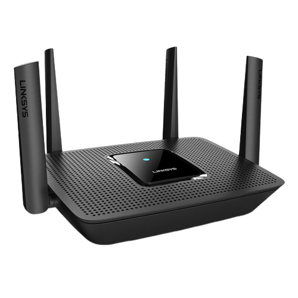

<div id="top"></div>
<!--
*** Thanks for checking out the Best-README-Template. If you have a suggestion
*** that would make this better, please fork the repo and create a pull request
*** or simply open an issue with the tag "enhancement".
*** Don't forget to give the project a star!
*** Thanks again! Now go create something AMAZING! :D
-->

<!-- PROJECT LOGO -->
<br />
<div align="center">
  <a href="https://github.com/GiovanniBaccichet/openwrt-multi-sniffer">
    
  </a>

  <h3 align="center">OpenWrt Multi-Channel Sniffer</h3>

  <p align="center">
    OpenWrt-based Access Point multi-channel WiFi Probe Request sniffer 📡
    <br />
    <a href="https://github.com/GiovanniBaccichet/openwrt-multi-sniffer/blob/main/Report/report.pdf"><strong>Download Report »</strong></a>
    <br />
    <br />
    <a href="https://baccichet.org">Developer 👨🏻‍💻</a>
    ·
    <a href="https://github.com/GiovanniBaccichet/openwrt-multi-sniffer/issues">Report Bug 🪳</a>
    ·
    <a href="https://github.com/GiovanniBaccichet/openwrt-multi-sniffer/issues">Request Feature ✨</a>
  </p>
</div>

<br />
<br />

<!-- ABOUT THE PROJECT -->
# Introduction

The goal of this project is use off-the-shelves hardware, paired with the open source router Operating System (OS) OpenWrt, to perform **WiFi Probe Request frame sniffing over multiple channels**, more specifically in the 2.4 GHz and 5 GHz spectrum.
Acquired data is then saved to a remote shared folder using SMB and **Tailscale** to access the cloud in a safe and reliable way.

<p align="right">(<a href="#top">back to top</a>)</p>

## Setup Overview

Our setup consisted in a `Linksys MR8300 v1.1`, running `OpenWrt 22.03.2`. The Linksys MR8300 is a MU-MIMO Tri-Band WiFi router, which has one 2.4GHz and two 5GHz WiFi Interfaces. We chose it for the generous amount of RAM (`512 MB`) and ROM (`256 MB` of NAND) present in the system, the powerful CPU (`Qualcomm IPQ4019`), as well as the great community support.

Additionally it has four 1 Gbps LAN ports, one 1 Gbps WAN port, an USB 3.0 interface and four external antennas. The device is equipped with a Bluetooth chip. With all that said, it is a good fit for a lot of similar projects and applications.

The [Table of Hardware](https://openwrt.org/toh/linksys/mr8300#hardware) offered by the OpenWrt wiki gives us interesting insights on the hardware that powers this router.

<p align="center">
  
  <br />
  <em>Linksys MR8300 Router</em>
</p>

We are interested in the Network Interface Cards (NICs) and their capabilities.

> The first 5 GHz radio (`IPQ4019`) is limited to ch. 64 and below. The second 5 GHz radio (`QCA9888`), is limited to ch. 100 and above. This is consistent with OEM firmware and is a result of the ART data and the data in the OEM firmware's cal data. This is perhaps due to RF design optimization and/or interoperation with 2.4 GHz, such as the two, shared antennas.

Considering that, with a little bit of research we can find the software interface arrangement:
- `radio0` → 5 GHz upper wireless phy interface
- `radio1` →	2.4 GHz wireless phy interface
- `radio2` →	5 GHz lower wireless phy interface

Both chipsets are monitor-mode capable.

<p align="right">(<a href="#top">back to top</a>)</p>

## Installation

The script uses the Scapy Python library to sniff WiFi Probe Requests and then save them as `.pcap` Network Packet Captures.

In order to install the required software, you can use the following command, accessing the router via SSH:

```bash
opkg update opkg install iw tcpdump tailscale kmod-fs-cifs kmod-nls-base jq
```

The list of known MAC address vendors can be found [here](https://gitlab.com/wireshark/wireshark/-/raw/master/manuf).

<p align="right">(<a href="#top">back to top</a>)</p>

<!-- CONTRIBUTING -->
# Contributing

Contributions are what make the open source community such an amazing place to learn, inspire, and create. Any contributions you make are **greatly appreciated**.

If you have a suggestion that would make this better, please fork the repo and create a pull request. You can also simply open an issue with the tag "enhancement".
Don't forget to give the project a star! Thanks again!

1. Fork the Project
2. Create your Feature Branch (`git checkout -b feature/AmazingFeature`)
3. Commit your Changes (`git commit -m 'Add some AmazingFeature'`)
4. Push to the Branch (`git push origin feature/AmazingFeature`)
5. Open a Pull Request

<p align="right">(<a href="#top">back to top</a>)</p>


<!-- LICENSE -->
# License

Distributed under the `GPLv3` License. See `LICENSE` for more information.

<p align="right">(<a href="#top">back to top</a>)</p>


<!-- CONTACT -->
# Contact

Giovanni Baccichet - [@Giovanni_Bacci](https://twitter.com/Giovanni_Bacci) - `github[at]baccichet.org`

<p align="right">(<a href="#top">back to top</a>)</p>


<!-- ACKNOWLEDGMENTS -->
## Acknowledgments

- [[OpenWrt Wiki] Documentation](https://openwrt.org/docs/start)
- [Docs - Tailscale](https://tailscale.com/kb/)

<p align="right">(<a href="#top">back to top</a>)</p>